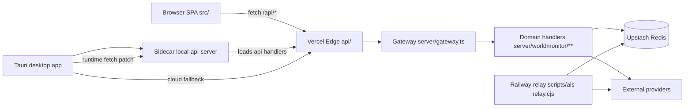
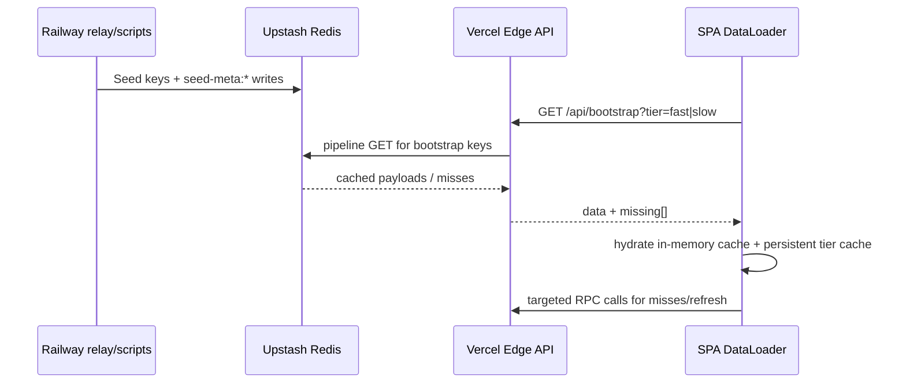
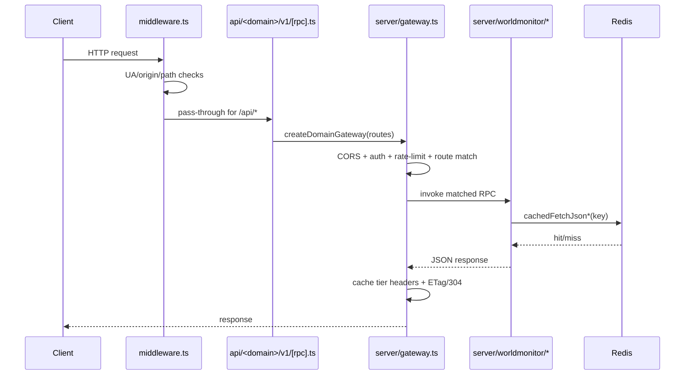
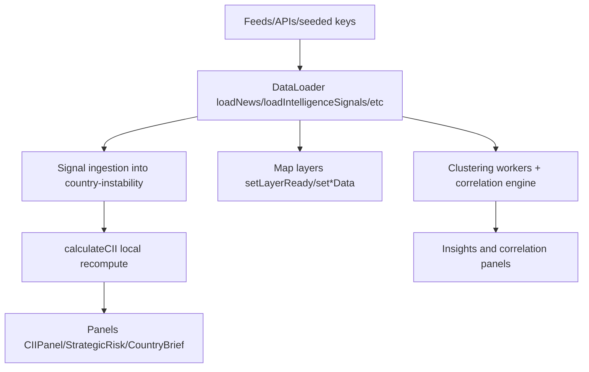
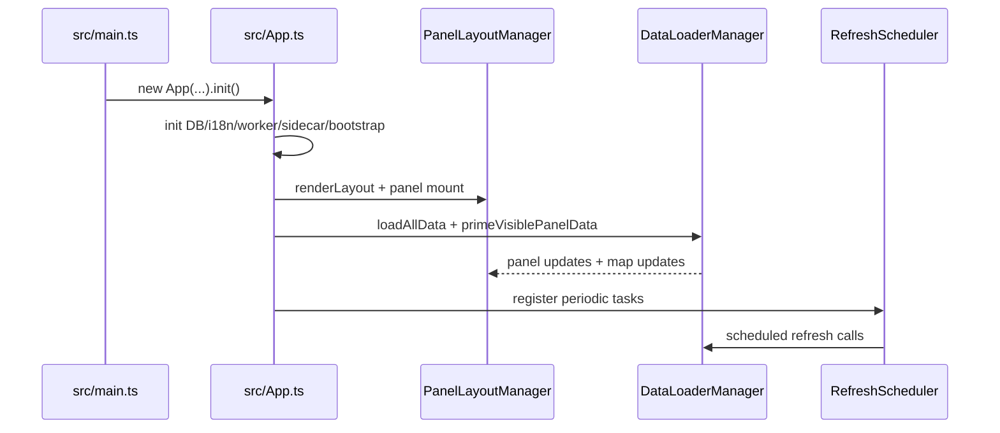

# ARCHITECTURE_Project

This document describes the current architecture as implemented in the repository (not a redesign).

## Project Overview

WorldMonitor is a real-time global intelligence dashboard with:

- A TypeScript SPA (Vite + Preact style DOM rendering) in `src/`
- Vercel Edge APIs in `api/` (legacy JS endpoints + domain RPC entrypoints)
- Server-side domain handlers in `server/worldmonitor/**` wired through a shared gateway (`server/gateway.ts`)
- A protocol-contract layer in `proto/` generated to `src/generated/{client,server}`
- A Tauri desktop runtime with sidecar local API fallback (`src-tauri/sidecar/` + `src/services/runtime.ts`)
- Railway relay/seed loops (`scripts/ais-relay.cjs`) and additional cron seed scripts
- Redis (Upstash) as the central cross-instance cache/seed state store

## Tech Stack

- Frontend: TypeScript, Vite, Preact, deck.gl, maplibre-gl, globe.gl
- Edge/API: Vercel Edge Functions (JS/TS), custom gateway/router
- Contracts: Protocol Buffers + sebuf HTTP annotations (`proto/worldmonitor/**`)
- Shared model/contracts: `shared/risk-score-spec.js` (plus proto-generated types)
- Caching: Upstash Redis REST + in-memory caches + browser persistent cache
- Desktop: Tauri 2.x + Node sidecar
- Testing: `node:test` (`tests/*.test.{mjs,mts}`), Playwright (`e2e/*.spec.ts`)

## Folder Structure Overview

- `src/`: SPA app orchestration, components, services, workers, types
- `api/`: Edge endpoints, CORS/api-key/rate-limit helpers, bootstrap/health/legacy routes, domain RPC wrappers
- `server/`: shared gateway/router/redis/rate-limit plus domain handlers
- `proto/`: service/message contract source
- `src/generated/`: generated client/server route + message types
- `shared/`: cross-runtime shared specs and data contracts
- `scripts/`: relay loops and seed jobs
- `src-tauri/`: desktop host + sidecar runtime
- `tests/`, `e2e/`: unit/integration and browser E2E coverage

## System Components

## Backend Architecture

### 1) API Surface Layers

1. Legacy root endpoints in `api/*.js` (examples: `api/events.js`, `api/bootstrap.js`, `api/health.js`, `api/version.js`)
2. Domain RPC wrappers in `api/<domain>/v1/[rpc].ts` (29 domains currently, e.g. `api/intelligence/v1/[rpc].ts`)
3. Domain handler implementations in `server/worldmonitor/<domain>/v1/*.ts`

### 2) Gateway + Router

- `server/gateway.ts` applies: origin check, CORS, OPTIONS, API key/session auth, endpoint/global rate limits, route match, POST->GET compatibility bridge, handler execution, cache tier headers, ETag generation, and `304` handling.
- `server/router.ts` uses:
  - O(1) exact map for static routes
  - Dynamic segment matcher for `{param}` routes

### 3) API Route Topology (actual)

RPC domain entrypoints exist for:

- aviation, climate, conflict, consumer-prices, cyber, displacement, economic, forecast, giving, imagery, infrastructure, intelligence, maritime, market, military, natural, news, positive-events, prediction, radiation, research, sanctions, seismology, supply-chain, thermal, trade, unrest, webcam, wildfire.

Legacy JS endpoints still present for ops/special flows:

- bootstrap, health, seed-health, events, mock-events, story, og-story, rss-proxy, contact, register-interest, download, version, mcp-proxy, etc.

### 4) Domain Handler Pattern

- `api/intelligence/v1/[rpc].ts` -> `createDomainGateway(createIntelligenceServiceRoutes(intelligenceHandler, serverOptions))`
- `server/worldmonitor/intelligence/v1/handler.ts` maps RPC names to function implementations.
- Route/method definitions originate in proto (`proto/worldmonitor/intelligence/v1/service.proto`) and generated server stubs.

## Frontend Architecture

### 1) Bootstrap and App Lifecycle

`src/App.ts` orchestrates multi-phase startup:

1. init DB + i18n
2. init ML worker (conditional)
3. desktop sidecar readiness wait
4. bootstrap hydrate (`fetchBootstrapData()`)
5. render layout (`PanelLayoutManager`)
6. setup UI components/modals/badges
7. setup managers (`SearchManager`, `CountryIntelManager`, `EventHandlerManager`)
8. run bulk + visible-panel primed data loads in parallel
9. start refresh schedules via `RefreshScheduler`

### 2) Render Model

- Class-based panel architecture (`src/components/Panel.ts` subclasses)
- `PanelLayoutManager` builds static shell and mounts panel instances
- `DataLoaderManager` pushes data into map + panels
- `EventHandlerManager` wires interaction, URL sync, visibility, idle handling

### 3) Frontend Runtime Modes

- Web mode: same-origin or redirected API base (`installWebApiRedirect()`)
- Desktop mode: fetch interception routes `/api/*` to local sidecar with bearer token; cloud fallback when allowed (`src/services/runtime.ts`)

## AI Scoring Workflow

There are multiple scoring flows implemented today.

### A) Shared Event Risk Contract (legacy event-level scoring)

- Contract source: `shared/risk-score-spec.js` and `shared/risk-score.js`
- Used by `api/events.js` to normalize events and ensure `risk_score`, `threshold`, `source`, `fallback_used` shape.

### B) Strategic CII scoring (server authoritative API)

- Endpoint: `/api/intelligence/v1/get-risk-scores`
- Handler: `server/worldmonitor/intelligence/v1/get-risk-scores.ts`
- Inputs merged from ACLED + cached auxiliary sources (UCDP, outages, climate, cyber, fires, GPS, Iran events, OREF, advisories, displacement, news threat summary)
- Output: `GetRiskScoresResponse` with `ciiScores[]` and `strategicRisks[]`
- Cache keys:
  - live: `risk:scores:sebuf:v1` (TTL 600s)
  - stale fallback: `risk:scores:sebuf:stale:v1` (TTL 3600s)

### C) Frontend local CII engine (parallel implementation)

- `src/services/country-instability.ts` computes local CII from client-ingested signals
- Consumed by `CIIPanel`, story/search/country-intel modules
- Cached server scores are adapted by `src/services/cached-risk-scores.ts` and rendered by `CIIPanel.renderFromCached()`

### Risk Score Creation and Consumption (current reality)

- Created server-side: `server/worldmonitor/intelligence/v1/get-risk-scores.ts`
- Seed freshness maintained by relay warm-ping: `scripts/ais-relay.cjs` (`seed-meta:intelligence:risk-scores`)
- Bootstrapped into UI via `api/bootstrap.js` key `riskScores -> risk:scores:sebuf:stale:v1`
- Consumed frontend by:
  - `src/services/cached-risk-scores.ts`
  - `src/app/data-loader.ts` (pre-render CII cache path)
  - `src/components/CIIPanel.ts`
  - `src/components/StrategicRiskPanel.ts`

## Data Pipeline Workflow

### Notes

- Bootstrap endpoint (`api/bootstrap.js`) reads Redis keys in one pipeline call.
- Frontend bootstrap service (`src/services/bootstrap.ts`) combines:
  - live tier data
  - cached tier data (persistent cache)
  - mixed source state tracking (`live|cached|mixed|none`)
- `DataLoaderManager.loadAllData()` runs staggered batched fetches to avoid upstream thundering.

## Cache Strategy

### 1) Edge response caching

- Gateway cache tiers in `server/gateway.ts` (`fast|medium|slow|slow-browser|static|daily|no-store`)
- Tier chosen via RPC path table (`RPC_CACHE_TIER`) + optional env override per RPC
- Sets both `Cache-Control` and `CDN-Cache-Control`
- ETag generated from response bytes; handles `If-None-Match` -> `304`

### 2) Redis data caching

- `server/_shared/redis.ts` provides:
  - `cachedFetchJson()` / `cachedFetchJsonWithMeta()`
  - in-flight coalescing map (single fetch per key per isolate)
  - negative sentinel caching (`__WM_NEG__`) for null responses
  - key prefixing for non-prod deployment isolation

### 3) Frontend caching

- Bootstrap hydration in-memory one-shot cache (`src/services/bootstrap.ts`)
- Persistent cache (IndexedDB-backed via persistent-cache service)
- Circuit breaker cache states (`src/utils/circuit-breaker.ts`) with stale serving and cooldown
- LocalStorage snapshots for selected datasets (e.g., risk scores)

### 4) Seed freshness metadata

- `seed-meta:*` keys tracked by `api/health.js`
- Health computes `OK/STALE_SEED/EMPTY/EMPTY_ON_DEMAND/OK_CASCADE`

## Request Lifecycle

## Event Processing Lifecycle

Key implementation points:

- News digest path with stale/per-feed fallback (`src/app/data-loader.ts`)
- Multi-source ingest functions into CII state (`ingest*ForCII` in `country-instability` service)
- Temporal anomaly integration path from server anomalies -> signal aggregator -> CII refresh

## Frontend Rendering Flow

## Testing Architecture

### 1) Unit and integration tests

- Framework: Node built-in test runner (`node --test`)
- Command: `npm run test:data`
- Coverage includes:
  - edge runtime constraints (`tests/edge-functions.test.mjs`)
  - scoring invariants (`tests/cii-scoring.test.mts`)
  - TTL/guard tests, cache key integrity, panel/variant guardrails

### 2) Sidecar/API focused tests

- Command: `npm run test:sidecar`
- Includes API helper tests and sidecar behavior tests

### 3) E2E tests

- Playwright config in `playwright.config.ts`
- Variant-specific runs and visual snapshot checks
- Runtime fetch behavior is explicitly covered (`test:e2e:runtime`)

## Fallback Strategy

Current fallback behavior is layered and explicit.

### Backend fallbacks

- `get-risk-scores`:
  - try live cached fetch
  - on failure return stale cache key
  - if none, compute minimal empty-aux output
- bootstrap endpoint returns partial `data` and `missing[]` instead of hard-fail
- health endpoint treats some on-demand keys as warnings, not critical failures

### Frontend fallbacks

- bootstrap tiers: live -> cached -> mixed state (`src/services/bootstrap.ts`)
- digest/news:
  - prefer server digest
  - fallback to stale in-memory category items
  - fallback to limited per-feed fetch if enabled
- risk scores:
  - bootstrap hydrated riskScores
  - breaker cached/localStorage state
  - RPC call
  - empty fallback object
- desktop runtime:
  - local sidecar request first
  - cloud fallback if endpoint and secrets permit (`src/services/runtime.ts`)

### Mock/fallback systems

- `api/mock-events.js` serves `/mocks/events.json`
- `api/events.js` has built-in mock event corpus + deterministic scoring/normalization

## Environment Variables

Primary env configuration source is `.env.example`.

High-impact groups:

- Redis/cache: `UPSTASH_REDIS_REST_URL`, `UPSTASH_REDIS_REST_TOKEN`
- API providers: ACLED/UCDP/FRED/EIA/Finnhub/OpenWeather/NewsAPI/etc.
- Relay/seeding: `WS_RELAY_URL`, `RELAY_SHARED_SECRET`, AIS/OpenSky/Telegram keys
- AI routing: `GROQ_API_KEY`, `OPENROUTER_API_KEY`, forecast model overrides
- Variant/runtime: `VITE_VARIANT`, `VITE_WS_API_URL`, `VITE_DESKTOP_RUNTIME`
- Auth: Clerk publishable/secret keys

## Deployment Assumptions

Observed deployment assumptions from code/config:

- Web/API hosted on Vercel (`vercel.json` rewrites/headers/CSP)
- API origin assumptions include `api.worldmonitor.app` and variant subdomains
- Railway relay continuously refreshes selected caches and seed-meta state (`scripts/ais-relay.cjs`)
- Upstash Redis is available for cache, health, and warm pipelines
- Desktop builds rely on sidecar local API and tokenized local auth path

## Known Architectural Risks

1. Duplicated scoring logic pipelines
- Server CII engine (`server/worldmonitor/intelligence/v1/get-risk-scores.ts`) and frontend CII engine (`src/services/country-instability.ts`) implement parallel but non-identical scoring systems.
- Risk: drift between map/panel local calculations and RPC risk outputs.

2. Schema fragmentation across event/risk models
- Legacy event scoring contract (`shared/risk-score-spec.js`, `api/events.js`) differs from sebuf `GetRiskScoresResponse` shape.
- Risk: multiple “risk score” meanings in UI and downstream consumers.

3. Central orchestration coupling
- `src/app/data-loader.ts` is a very large multi-domain orchestrator with many direct service/panel dependencies.
- Risk: high regression probability and difficult isolated testing.

4. Bootstrap key duplication and drift potential
- Bootstrap key registries are present in multiple places (`api/bootstrap.js`, `api/health.js`, `server/_shared/cache-keys.ts`).
- Risk: inconsistent tiering/health checks/missing key behavior over time.

5. Fragile frontend assumptions by panel ID and viewport checks
- Refresh and priming conditions are tightly bound to hard-coded panel IDs and map-layer switches in `App.ts`.
- Risk: subtle breakage when panel IDs/config change.

6. Legacy + RPC API coexistence complexity
- Legacy `api/*.js` and generated RPC domain routes coexist.
- Risk: inconsistent auth/caching/error semantics between old/new paths.

## Current Architecture Strengths

- Clear domain RPC layering from proto -> generated routes -> handlers
- Strong gateway cross-cutting controls (CORS/auth/rate-limit/cache-tier/etag)
- Multi-layer fallback behavior improves resiliency for demos/live ops
- Redis seed-meta health model provides concrete staleness visibility
- Desktop runtime can operate through local sidecar with cloud fallback

## Current Architecture Weaknesses

- Multiple scoring engines and contracts for related risk concepts
- Very large orchestration modules (`DataLoaderManager`, startup flow in `App.ts`)
- Key registry duplication across bootstrap/health/shared files
- Mixed legacy and generated API surfaces increase policy inconsistency risk
- Some fallback behavior depends on localStorage/previous in-memory state ordering

## Recommended Improvements

These are refactoring priorities for current architecture stabilization (not redesign):

1. Unify scoring source-of-truth
- Define one canonical CII scoring module shared by server and client (or server-authoritative + deterministic adapter).

2. Consolidate cache key registries
- Generate bootstrap and health key maps from one source (or enforce compile-time parity checks).

3. Decompose `DataLoaderManager`
- Split by domain (news/intel/market/geo/forecast) with explicit interfaces and isolated tests.

4. Normalize risk schema vocabulary
- Align event-level risk fields and CII response semantics in docs/types to reduce ambiguity.

5. Gate legacy endpoints behind explicit migration policy
- Keep allowlist but add route-level parity checks for auth/cache headers between legacy and RPC paths.

## Recommended Refactoring Priorities

1. Scoring pipeline convergence (highest correctness impact)
2. Bootstrap/health/cache key source unification (highest operational reliability impact)
3. DataLoader modularization (highest maintainability impact)
4. Legacy endpoint parity hardening (security and behavior consistency)
5. Panel ID coupling reduction via declarative refresh metadata

## Critical Architectural Risk Summary

- Critical risks:
  - Divergent risk-scoring paths (server vs frontend local)
  - Registry drift among bootstrap/health/cache-key maps
  - DataLoader coupling causing broad blast radius for changes

- Most coupled subsystem:
  - `src/app/data-loader.ts` + `src/App.ts` orchestration path

- Most fragile workflow:
  - News/intel fallback chain (digest -> stale -> limited per-feed) combined with panel/render timing and status updates

- Safest path for demo stability:
  - Keep server risk scores as authoritative display source during demos
  - prioritize stale-cache bootstrap keys and seed-meta freshness alarms
  - avoid large panel-id or scheduler refactors close to demo time
  - run `npm run test:data` + `npm run test:e2e:runtime` + target variant E2E before release
