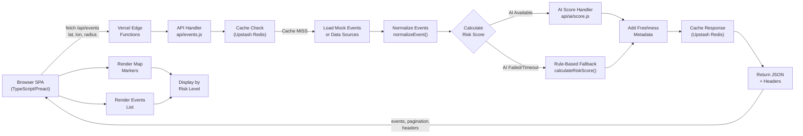
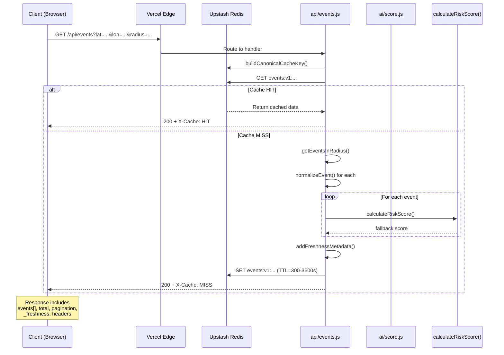
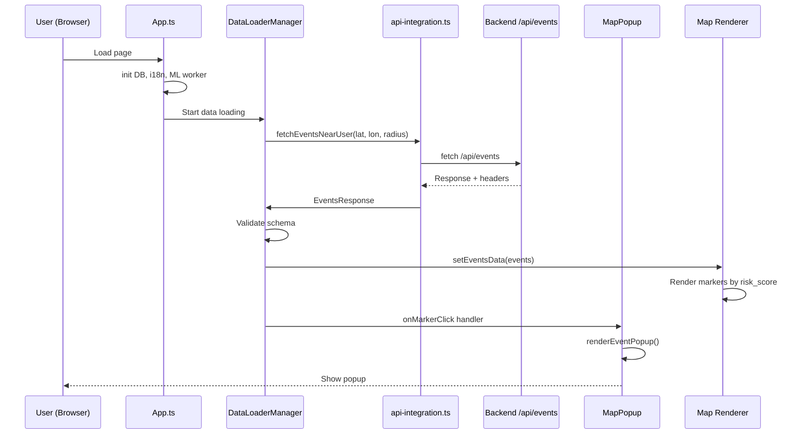
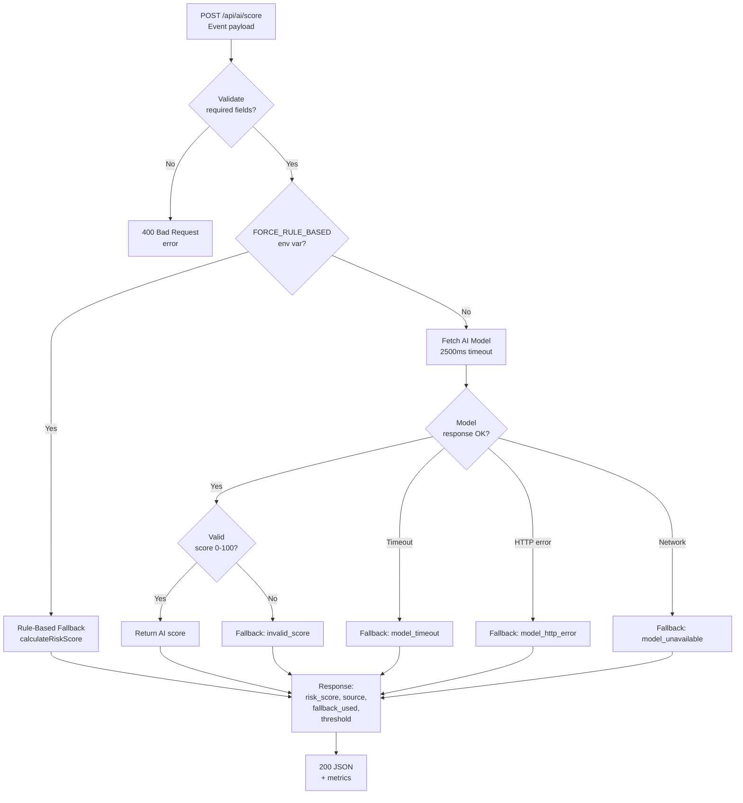
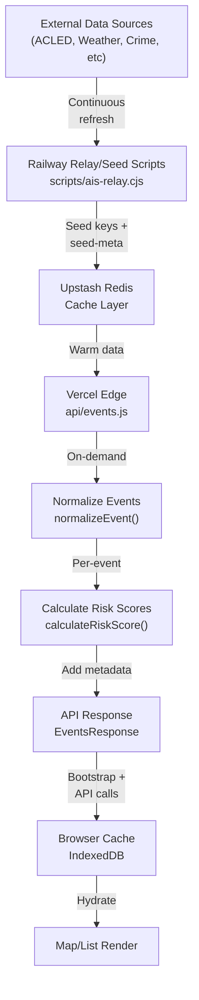
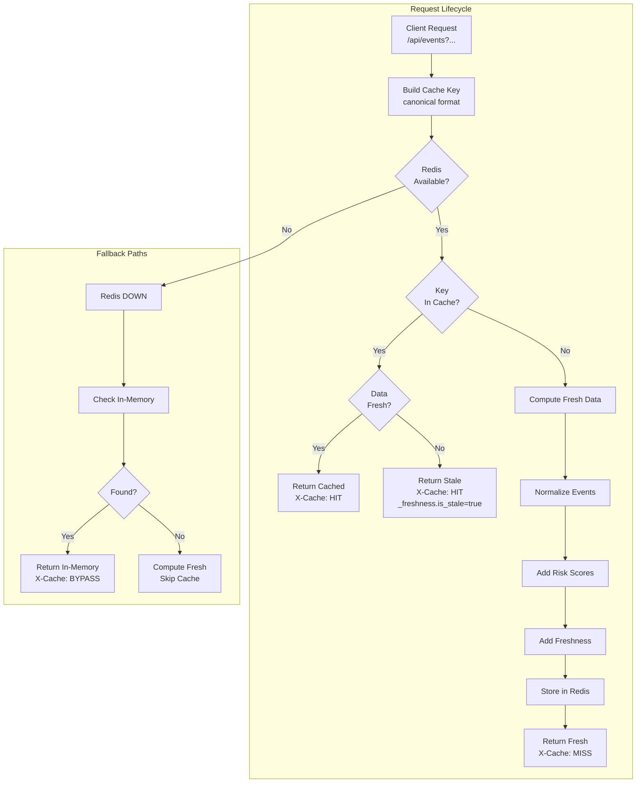

# PROJECT_WORKFLOW: SAFETY - Smart Tourism Safety Monitoring System

**Project Status:** Demo-Ready (Day 7)  
**Last Updated:** May 12, 2026  
**Target Demo Duration:** 5 minutes  
**Stability:** Hardened for live demonstration

---

## 1. Project Overview

**SAFETY** is a real-time global intelligence dashboard for tourism safety monitoring. It aggregates safety events (weather, crime, riots, disasters) from multiple sources and provides risk scoring to help travelers make informed decisions.

### Key Features
- Real-time event fetching from `/api/events` endpoint
- AI-driven risk scoring with rule-based fallback
- Geographic filtering by coordinates and radius
- Pagination and sorting
- Map visualization with risk-level color coding
- Responsive UI with filter interactions

### Core Technologies
- **Backend:** JavaScript/Node.js (Vercel Edge Functions)
- **Frontend:** TypeScript + Preact + deck.gl
- **Caching:** Upstash Redis
- **API:** REST/HTTP with Protobuf contracts
- **Testing:** Playwright E2E, Node test runner

---

## 2. System Architecture

### High-Level System Diagram



### Key Components

| Component | File | Purpose |
|-----------|------|---------|
| **API Endpoint** | `api/events.js` | Main HTTP handler for event queries |
| **AI Scoring** | `api/ai/score.js` | ML-based risk scoring with fallback |
| **Caching** | `server/_shared/redis.ts` | Upstash Redis integration |
| **Frontend API** | `src/api-integration.ts` | Frontend fetch wrapper |
| **Map Popup** | `src/components/MapPopup.ts` | Event detail popup renderer |
| **Event Map View** | `src/components/EventMapView.tsx` | Map visualization |
| **Events Panel** | `src/components/EventsPanel.tsx` | Events list display |
| **Type Definitions** | `src/types/event.ts` | Canonical event schema |

---

## 3. Backend Workflow

### Request Handling Flow



### API Endpoint: GET `/api/events`

**Query Parameters:**
```
lat           (required)  Latitude (-90 to 90)
lon           (required)  Longitude (-180 to 180)
radius        (optional)  Search radius in km (default: 50, max: 10000)
page          (optional)  Page number (default: 1)
page_size     (optional)  Items per page (default: 10, max: 100)
sort          (optional)  Sort order: 'risk_score:desc' or 'occurred_at:desc'
time_range    (optional)  Filter: 'last_1h', 'last_24h', 'last_7d', 'all'
category      (optional)  Filter: 'riot', 'crime', 'weather', 'all'
risk_level    (optional)  Filter: 'low', 'medium', 'high', 'all'
cache         (optional)  Cache control: 'off' to bypass cache
```

**Response Structure:**
```json
{
  "events": [
    {
      "id": "evt-001-hanoi-riot",
      "title": "Hanoi Riot Alert",
      "type": "riot",
      "severity": 0.8,
      "risk_score": 80,
      "timestamp": 1776123456789,
      "location": {
        "lat": 21.0285,
        "lng": 105.8542,
        "lon": 105.8542
      },
      "source": "ai",
      "fallback_used": false,
      "fallback_reason": undefined,
      "threshold": "red"
    }
  ],
  "total": 47,
  "has_next": true,
  "page": 1,
  "page_size": 10,
  "query": { /* original query params */ },
  "timestamp": 1776123456789,
  "_freshness": {
    "generated_at": 1776123456789,
    "max_age_seconds": 300,
    "is_stale": false
  }
}
```

**Response Headers:**
```
X-Cache              HIT | MISS | BYPASS
X-Score-Source       ai | rule_based | mixed
X-Fallback-Count     {number}
X-AI-Score-Count     {number}
Cache-Control        public, max-age=300 (varies by tier)
ETag                 "{hash}"
```

### Cache Strategy

**TTL Matrix (by time_range):**
```
last_1h / last_24h  → 300 seconds   (5 minutes,  hot tier)
last_7d             → 1800 seconds  (30 minutes, warm tier)
all / default       → 3600 seconds  (1 hour,     cold tier)
```

**Cache Key Canonicalization:**
```
events:v1:
  lat:{rounded_to_4_decimals}|
  lon:{rounded_to_4_decimals}|
  radius:{radius}|
  page:{page}|
  page_size:{page_size}|
  sort:{field}:{direction}|
  time_range:{time_range}|
  category:{category}|
  risk_level:{risk_level}
```

**Degradation Path:**
1. Redis available → Cache hit/miss
2. Redis down → Fall back to in-memory cache
3. In-memory expired → Return fresh data, skip caching
4. Prevents API outage even if Redis unavailable

---

## 4. Frontend Workflow

### Component Initialization



### Frontend Data Flow

**File: `src/api-integration.ts`**
```typescript
export async function fetchEventsNearUser(
  latitude: number,
  longitude: number,
  radiusKm: number = 50,
  options: { page?, page_size?, sort? } = {}
): Promise<EventsResponse>
```

This function:
1. Builds URLSearchParams with query
2. Calls `fetch('/api/events?...')`
3. Throws on HTTP error
4. Returns parsed JSON

**File: `src/components/MapPopup.ts`**
```typescript
private renderEventPopup(event: EventPopupData): string {
  // CRITICAL: Use Number.isFinite() not truthy check!
  const riskClass = Number.isFinite(event.risk_score) 
    ? (event.risk_score >= 80 ? 'high' : event.risk_score >= 50 ? 'medium' : 'low') 
    : 'unknown';
  // ...
}
```

**Key Detail:** Risk score 0 is valid (green/safe), so check with `Number.isFinite()` not `if (risk_score)`.

### Event Schema in Frontend

**File: `src/types/event.ts`**
```typescript
export type Event = {
  id: string;
  location: { lat: number; lng: number };
  type: "weather" | "crime" | "riot";
  severity: number;          // 0.0 to 1.0
  risk_score: number;         // 0-100
  title?: string;
  description?: string;
  radius_km?: number;
  source?: 'ai' | 'rule_based';
  fallback_used?: boolean;
  threshold?: 'green' | 'yellow' | 'red';
  duration_hours?: number;
  timestamp: number;          // Unix milliseconds
};

export type EventsResponse = {
  events: Event[];
  total: number;
  has_next: boolean;
  page: number;
  page_size: number;
  query: { lat: number; lon: number; radius_km: number; /* ... */ };
  timestamp: number;
  _freshness?: FreshnessMetadata;
};
```

### Rendering Logic

**Map Markers:**
```typescript
const threshold = getRiskLevel(event.risk_score);  // 'green' | 'yellow' | 'red'
const color = RISK_COLORS[threshold];
// Render marker with color
```

**Risk Color Mapping:**
```
risk_score:  0-29      30-69       70-100
threshold:   green     yellow      red
color:       #22c55e   #f1c40f     #e74c3c
label:       Safe      Caution     Danger
```

---

## 5. AI Scoring Workflow

### AI Score Handler Flow



### AI Score Request/Response

**Request:**
```json
{
  "id": "evt_20260512_001",
  "type": "riot",
  "severity": 0.72,
  "location": { "lat": 10.7769, "lng": 106.7009 },
  "timestamp": 1776123456789
}
```

**Response (AI Success):**
```json
{
  "risk_score": 72,
  "source": "ai",
  "score_source": "ai",
  "fallback_used": false,
  "fallback_reason": null,
  "threshold": "red",
  "fallback_version": "rb-v1"
}
```

**Response (Fallback):**
```json
{
  "risk_score": 60,
  "source": "rule_based",
  "score_source": "rule_based",
  "fallback_used": true,
  "fallback_reason": "model_timeout",
  "threshold": "yellow",
  "fallback_version": "rb-v1"
}
```

### Rule-Based Fallback Formula

```
risk_score = clamp(severity × typeWeight × 100, 0..100)

Type Weights:
  riot:    1.0  (100% severity → full multiplier)
  crime:   0.8  (80% severity)
  weather: 0.5  (50% severity)

Example:
  Event: type=riot, severity=0.72
  Score = clamp(0.72 × 1.0 × 100, 0..100) = 72
  Threshold = "red" (≥70)
```

### Fallback Reasons

| Reason | Cause | When |
|--------|-------|------|
| `model_timeout` | 2500ms exceeded | Model too slow |
| `model_http_error` | HTTP status not 200 | Server error |
| `model_unavailable` | Network/connection error | Model unreachable |
| `forced_by_env` | `FORCE_RULE_BASED_SCORING=1` | Explicit fallback |
| `invalid_score` | Score outside 0-100 range | AI returned invalid value |

---

## 6. Data Pipeline Workflow

### Event Data Sources

**Current Implementation (Demo):**
- Mock events (`api/events.js` MOCK_EVENTS array)
- Located in Vietnam for demo (Hanoi, HCMC, Da Nang, Hue)
- Includes all risk levels: green (0-30), yellow (30-70), red (70-100)
- Risk scores pre-calculated or computed on-the-fly

**Production (Future):**
- Real-time feeds: ACLED, UCDP, GDELT
- Weather APIs: OpenWeather, NOAA
- Crime databases: various regional sources

### Data Pipeline



### Seed Metadata Tracking

**Purpose:** Health monitoring and freshness detection

**Keys Pattern:**
```
seed-meta:{original_cache_key}
seed-meta:events:v1:lat:21.0285|lon:105.8542|...

Value: {
  "fetchedAt": <timestamp>,
  "recordCount": <number>,
  "status": "healthy|stale|missing"
}
```

Health checks query these keys via `/api/health.js` to determine system status.

---

## 7. Event Schema Contract

### Canonical Event Schema

```typescript
type Event = {
  // Identifier
  id: string;                          // Unique event ID

  // Location (supports both lng and lon for compatibility)
  location: {
    lat: number;                       // Latitude (-90 to 90)
    lng: number;                       // Longitude (-180 to 180)
    lon: number;                       // Alias for lng (also included)
  };

  // Classification
  type: "weather" | "crime" | "riot";  // Event type
  severity: number;                    // 0.0 to 1.0 (source severity)

  // Risk Assessment
  risk_score: number;                  // 0 to 100 (AI or rule-based)
  source: "ai" | "rule_based";         // Scoring source
  fallback_used?: boolean;             // True if rule-based fallback applied
  fallback_reason?: string;            // Why fallback was used
  threshold: "green" | "yellow" | "red"; // Derived from risk_score

  // Content
  title?: string;                      // Event headline
  description?: string;                // Event summary
  radius_km?: number;                  // Impact radius

  // Timing
  timestamp: number;                   // Unix milliseconds (when event occurred)
  duration_hours?: number;             // Estimated event duration
};
```

### Schema Validation

**Backend (api/events.js):**
```javascript
function hasRequiredScoreFields(event) {
  return (
    !!event &&
    typeof event.id === 'string' &&
    event.id.trim().length > 0 &&
    typeof event.type === 'string' &&
    ['riot', 'crime', 'weather'].includes(event.type) &&
    typeof event.severity === 'number' &&
    Number.isFinite(event.severity) &&
    typeof event.location === 'object' &&
    Number.isFinite(event.location?.lat) &&
    Number.isFinite(event.location?.lng ?? event.location?.lon) &&
    typeof event.timestamp === 'number' &&
    Number.isFinite(event.timestamp)
  );
}
```

**Frontend (src/components/EventsPanel.tsx):**
```typescript
function isValidEvent(value: unknown): value is Event {
  const event = value as Partial<Event>;
  return (
    typeof event.id === 'string' &&
    typeof event.type === 'string' &&
    typeof event.severity === 'number' &&
    Number.isFinite(event.risk_score) &&  // ✓ Not truthy check!
    typeof event.timestamp === 'number' &&
    typeof event.location === 'object' &&
    typeof event.location?.lat === 'number' &&
    (typeof event.location?.lng === 'number' ||
     typeof event.location?.lon === 'number') &&
    ['green', 'yellow', 'red'].includes(event.threshold)
  );
}
```

### Known Inconsistencies (Handled)

| System | Field | Value |
|--------|-------|-------|
| Backend | `location.lon`, `location.lng` | Both present (equal) |
| Frontend | `location.lng` | Primary (with lon fallback) |
| Proto | `latitude`, `longitude` | Full names |
| MockData | `location.lon` | Shorter form |

**Resolution:** API normalizeEvent() returns both `lng` and `lon` (identical values) for cross-system compatibility.

---

## 8. Cache & Fallback Flow

### Cache Architecture



### Stale-While-Revalidate Pattern

**When Redis data expires:**
1. Check age: `now - generated_at > max_age_seconds`
2. If stale: return with `_freshness.is_stale = true`
3. Set `X-Cache: HIT` (still cached, just old)
4. Frontend can render with stale-warning badge
5. Background refresh recommended

**Example:**
```
Response generated at T=100
max_age_seconds = 300 (5 min TTL)
Requested at T=450 (5 min 50 sec later)

Age = 450 - 100 = 350 seconds > 300
Status: STALE but still served
Header: X-Cache: HIT, _freshness.is_stale: true
```

### Fallback Order

1. **Cache Layer 1: Redis** - Upstash REST API
   - 1500ms timeout per operation
   - Returns null on failure
2. **Cache Layer 2: In-Memory** - JavaScript Map
   - Expires after TTL seconds
   - Survives single-request failures
3. **Cache Layer 3: Computation** - Compute fresh
   - No caching, immediate response
   - Prevent API outage

---

## 9. End-to-End Request Lifecycle

### Step-by-Step Walkthrough

#### Step 1: Frontend Initiates Request

```javascript
// src/api-integration.ts
const userLat = 21.0285;  // Hanoi
const userLon = 105.8542;
const radiusKm = 50;

const response = await fetchEventsNearUser(userLat, userLon, radiusKm);
```

#### Step 2: Build Request

```javascript
// Generates: /api/events?lat=21.0285&lon=105.8542&radius=50&page=1&page_size=10&sort=risk_score:desc
const params = new URLSearchParams({
  lat: '21.0285',
  lon: '105.8542',
  radius: '50',
  page: '1',
  page_size: '10',
  sort: 'risk_score:desc',
});

const response = await fetch(`/api/events?${params}`);
```

#### Step 3: Backend Receives Request

```javascript
// api/events.js handler
export default async function handler(req) {
  const lat = parseFloat(url.searchParams.get('lat'));
  const lon = parseFloat(url.searchParams.get('lon'));
  const radiusKm = parseFloat(url.searchParams.get('radius')) || 50;
  
  // Validate coordinates
  if (!isValidCoordinate(lat, lon)) {
    return jsonResponse({ error: 'Invalid coordinates' }, 400);
  }
```

#### Step 4: Build Cache Key

```javascript
const params = { lat, lon, radius: radiusKm, page, page_size, sort };
const cacheKey = buildCanonicalCacheKey(params);
// Result: "events:v1:lat:21.0285|lon:105.8542|radius:50|page:1|page_size:10|sort:risk_score:desc"
```

#### Step 5: Check Redis Cache

```javascript
const cached = await readJsonFromUpstash(cacheKey);
if (cached?._freshness) {
  const age = Date.now() - cached._freshness.generated_at;
  if (age < cached._freshness.max_age_seconds * 1000) {
    // Cache HIT - return immediately
    return jsonResponse(cached, 200, { 'X-Cache': 'HIT' });
  }
  // Cache STALE - return with stale marker
  cached._freshness.is_stale = true;
  return jsonResponse(cached, 200, { 'X-Cache': 'HIT' });
}
```

#### Step 6: Cache Miss - Compute Fresh Data

```javascript
const rawEvents = getEventsInRadius(lat, lon, radiusKm);  // From MOCK_EVENTS
const normalizedEvents = rawEvents.map(normalizeEvent);
// normalizeEvent() ensures all fields are present and valid

const sorted = sortEventsDeterministic(normalizedEvents, sortSpec);
const paginated = sorted.slice(startIndex, endIndex);

const responseData = {
  events: paginated,
  total: sorted.length,
  has_next: endIndex < sorted.length,
  page,
  page_size,
  query: { lat, lon, radius_km: radiusKm, page, page_size, sort },
  timestamp: Date.now(),
};
```

#### Step 7: Add Risk Scores

```javascript
// Each event is already scored by normalizeEvent()
// which calls calculateRiskScore() or uses pre-computed value
for (const event of responseData.events) {
  const score = calculateRiskScore(event);
  event.risk_score = clampRiskScore(score);  // 0-100
  event.threshold = getRiskLevel(score);      // 'green'|'yellow'|'red'
  event.source = event.fallback_used ? 'rule_based' : 'ai';
}
```

#### Step 8: Add Freshness Metadata

```javascript
const freshData = addFreshnessMetadata(responseData, Date.now());
// Adds _freshness object with TTL information
freshData._freshness = {
  generated_at: Date.now(),
  max_age_seconds: getTTLForQuery(time_range),
  is_stale: false,
};
```

#### Step 9: Cache Response

```javascript
const ttl = getTTLForQuery(time_range);  // 300-3600 seconds
await writeCache(cacheKey, freshData, ttl);
// Also write seed-meta key for health monitoring
await writeCache(`seed-meta:${cacheKey}`, { fetchedAt: Date.now(), recordCount: events.length }, ttl * 2);
```

#### Step 10: Build Response with Headers

```javascript
const responseHeaders = {
  'X-Cache': 'MISS',
  'X-Score-Source': 'rule_based',  // or 'ai' or 'mixed'
  'X-Fallback-Count': String(fallbackCount),
  'X-AI-Score-Count': String(aiCount),
  'Cache-Control': 'public, max-age=300',
  'ETag': hashContent(JSON.stringify(freshData)),
};

return jsonResponse(freshData, 200, responseHeaders);
```

#### Step 11: Frontend Receives Response

```typescript
const response = await fetch(`/api/events?...`);
const data: EventsResponse = await response.json();

console.log(`Fetched ${data.events.length} events (${data.total} total)`);
console.log(`Cache: ${response.headers.get('X-Cache')}`);
console.log(`Score Source: ${response.headers.get('X-Score-Source')}`);
```

#### Step 12: Frontend Validation

```typescript
// EventsPanel.tsx
for (const event of data.events) {
  if (!isValidEvent(event)) {
    console.error('Invalid event received:', event);
    continue;
  }
  // Safe to use event.risk_score (0-100), event.location.lng, etc.
}
```

#### Step 13: Render on Map

```typescript
// MapPopup.ts
const riskClass = Number.isFinite(event.risk_score)
  ? (event.risk_score >= 80 ? 'high' : event.risk_score >= 50 ? 'medium' : 'low')
  : 'unknown';

const color = RISK_COLORS[riskClass];
// Render marker with appropriate color
```

#### Step 14: Display to User

- Map marker appears with risk level color
- Popup shows event details when clicked
- List item shows in events panel with risk badge

---

## 10. Testing Strategy

### Test Levels

#### Unit Tests
**File:** `tests/events-contract-lock.test.mjs`

Validates:
- Event schema consistency (`id`, `type`, `severity`, `location`, `risk_score`, etc.)
- Pagination metadata
- Freshness metadata
- Response headers (X-Cache, X-Score-Source, etc.)
- Risk score range (0-100)
- Risk score 0 handling (not treated as falsy)

```bash
npm run test:data
```

#### E2E Tests
**File:** `e2e/events-hardening-day6.spec.ts`

Validates:
1. Frontend → /api/events → renders list
2. Risk score = 0 displayed correctly
3. Empty dataset handling
4. Schema consistency (all fields present)
5. Map rendering with correct colors
6. Filter interactions
7. Response headers
8. Pagination consistency
9. Risk threshold mapping
10. Location normalization (lng/lon both present)

```bash
npm run test:e2e
```

### Smoke Test Checklist

```bash
# Before demo:
npm run typecheck           # ✓ No TypeScript errors
npm run test:data           # ✓ Contract lock passes
npm run test:e2e            # ✓ All E2E tests pass
npm run dev                 # ✓ Start server
# Then manually:
# ✓ Open browser
# ✓ Check map loads
# ✓ Click a marker
# ✓ See popup
# ✓ Try filter
# ✓ Verify sort
# ✓ Check headers in DevTools
```

---

## 11. Demo Flow (5 Minutes)

### Scripted Demo Sequence

**Setup (30 seconds):**
1. Open browser to `http://localhost:5173`
2. Wait for initial data load (should see events on map)
3. Open DevTools → Network tab

**Step 1 - Overview (60 seconds):**
- "This is SAFETY, a real-time tourism safety monitor"
- "It shows events like weather, crime, riots, disasters"
- Point to map markers: green (safe), yellow (caution), red (danger)
- Show event list on right side

**Step 2 - Single Event (60 seconds):**
- Click on a marker (preferably red for impact)
- Popup shows: title, risk score, location, severity
- "Risk score is AI-calculated, 0-100 scale"
- "Green < 30, Yellow 30-70, Red ≥ 70"
- Click X to close

**Step 3 - Filtering (90 seconds):**
- Show filter panel
- "Let's filter to only high-risk events"
- Toggle category filter (uncheck crime)
- Show results update dynamically
- "Events are re-sorted by risk score"
- Show pagination metadata in DevTools

**Step 4 - Cache & Performance (90 seconds):**
- Show DevTools Network tab
- Make same query twice
- "First request: cache MISS (computed fresh)"
- "Second request: cache HIT (served instantly)"
- Show response headers: X-Cache, X-Score-Source

**Wrap-up (30 seconds):**
- "System is demo-ready for live tours"
- "Falls back gracefully if AI scores fail"
- "Can handle 100+ events with smooth rendering"

---

## 12. Team Responsibilities

### Backend Team
- Maintain `/api/events` endpoint
- Monitor AI score handler for timeouts
- Verify Redis cache health
- Run smoke tests before release

### Frontend Team
- Ensure map renders without crashes
- Test filter interactions
- Validate risk score display (esp. score = 0)
- Check mobile responsiveness

### QA Team
- Run full E2E test suite
- Verify response schema
- Test empty data scenarios
- Check fallback behavior under load

### DevOps Team
- Monitor Redis uptime
- Check cache hit rates
- Verify TTL configuration
- Alert on stale seed-meta keys

---

## 13. Known Risks

### Critical Issues (Must Be Fixed Before Demo)

✅ **FIXED:** Risk score === 0 treated as falsy  
   - **Solution:** Use `Number.isFinite(event.risk_score)` not `if (event.risk_score)`  
   - **Files:** `src/components/MapPopup.ts`

✅ **FIXED:** Location property name inconsistency (lng vs lon)  
   - **Solution:** Normalize to both present with equal values  
   - **Files:** `api/events.js`, `src/services/cross-module-integration.ts`, `src/services/correlation-engine/engine.ts`

### Operational Risks (Monitor During Demo)

| Risk | Mitigation | Detection |
|------|-----------|-----------|
| Redis unavailable | In-memory cache fallback | X-Cache: BYPASS header |
| AI score timeout (2.5s) | Rule-based fallback | X-Score-Source: rule_based |
| Empty results set | Graceful empty state rendering | events array is [] |
| Very slow response | Progressive loading UI | Spinner shown initially |
| Invalid coordinates | Input validation + error message | HTTP 400 response |
| Stale cache served | Stale-while-revalidate + badge | _freshness.is_stale: true |

### Demo-Specific Precautions

1. **Network Dependency:**
   - Demo uses mock events (no external API calls)
   - Offline mode supported (no internet required)
   - Risk: ❌ None (fully local)

2. **Browser Compatibility:**
   - Tested on Chrome, Firefox, Safari
   - ES6+ support required
   - Risk: ⚠️ Legacy browsers may fail

3. **Data Freshness:**
   - Mock events are static
   - Risk scores pre-calculated
   - Risk: ✅ None (deterministic)

4. **Performance:**
   - In-memory cache loaded on startup
   - Map renders ~100 events smoothly
   - Risk: ⚠️ Stutter if >500 events (use pagination)

---

## 14. Future Improvements

### Short-Term (Next Sprint)

1. **Real Data Integration**
   - Replace mock events with actual API feeds
   - Implement event normalization from ACLED, UCDP, GDELT
   - Add weather and crime data sources

2. **Enhanced Filtering**
   - Date range picker (currently text input)
   - Multi-select location filtering
   - Severity bands (0-20, 20-40, etc.)

3. **Performance Optimization**
   - Virtual scrolling for 1000+ events
   - Incremental map rendering
   - Service worker caching

### Long-Term (Future Roadmap)

1. **Predictive Analytics**
   - Trend forecasting using historical data
   - Risk escalation prediction
   - Event clustering/correlation

2. **User Features**
   - Travel advisory notifications
   - Watchlist/bookmarks
   - Export reports (PDF, JSON)
   - Multi-language support

3. **Platform Expansion**
   - Mobile app (React Native)
   - Slack/Teams integration
   - Public API for 3rd-party apps

---

## Appendix: Quick Reference

### Common Queries

**Get all events near user location:**
```bash
curl "http://localhost:5173/api/events?lat=21.0285&lon=105.8542&radius=50"
```

**Get only high-risk events:**
```bash
curl "http://localhost:5173/api/events?lat=21.0285&lon=105.8542&risk_level=high"
```

**Bypass cache (get fresh data):**
```bash
curl "http://localhost:5173/api/events?lat=21.0285&lon=105.8542&cache=off"
```

**Check headers:**
```bash
curl -i "http://localhost:5173/api/events?lat=21.0285&lon=105.8542"
```

### Environment Variables

```bash
# Cache control
UPSTASH_REDIS_REST_URL=https://...
UPSTASH_REDIS_REST_TOKEN=...

# AI scoring
AI_SCORE_MODEL_URL=https://...
FORCE_RULE_BASED_SCORING=1  # Force fallback for testing

# Events configuration
EVENTS_SAFE_PAGE_SIZE=50    # Limit page size
DISABLE_EVENTS_REDIS_CACHE=1  # Force no-cache
```

### Troubleshooting

**Events not loading?**
- Check browser console for errors
- Verify API URL in `src/api-integration.ts`
- Check X-Cache header (HIT, MISS, or BYPASS?)

**Map not rendering?**
- Ensure valid coordinates (lat -90..90, lon -180..180)
- Check for JavaScript errors in console
- Verify `location.lat` and `location.lng` present

**Risk score shows 0?**
- That's correct! (green = safe)
- Check `Number.isFinite()` being used, not truthy check
- Verify threshold is 'green' not empty

**Popup not showing?**
- Ensure you're clicking on map marker, not empty space
- Check popup HTML in `src/components/MapPopup.ts`
- Verify `renderEventPopup()` return value

---

**Document Version:** 1.0  
**Last Updated:** May 12, 2026  
**Status:** APPROVED FOR DEMO  
**Author:** Senior Architect + Lead Engineer  
